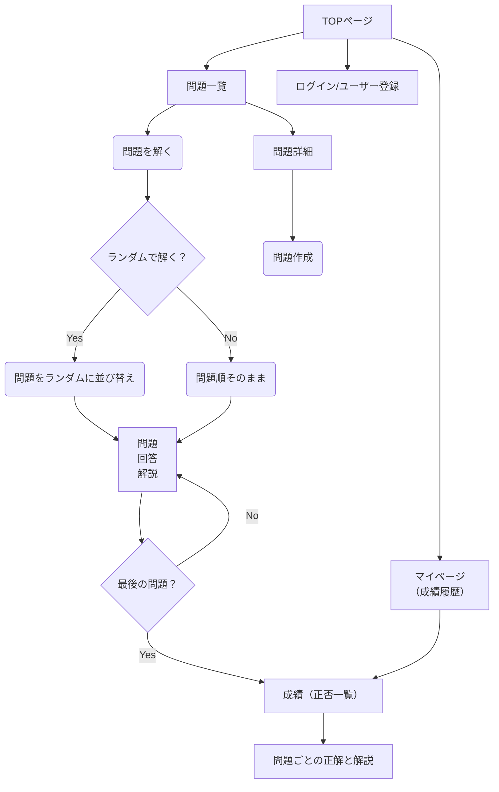
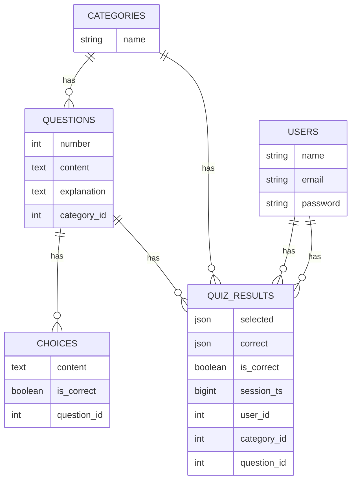

## インストール
1. このリポジトリをCloneして利用して下さい。
2. 問題と正解のデータセット(csvファイル)は公開していません。自身で用意するか、知り合いの方は個人的に問い合わせて下さい。
- 現在提供可能なデータセット
  - Ruby Silver
    - 基礎力確認問題（30問）
    - 模擬試験（50問） 

## 使い方
### 1. ユーザー登録
成績管理のために必要です。

### 2. 問題作成
(1) 問題一覧ページからカテゴリー名を登録

(2)問題詳細ページからアクセスできる[CSVアップロードガイドライン](app/views/home/csv_upload_guidelines.html)を参考に、csvファイルを用意してアップロードして下さい。

## 設計情報
### 画面遷移、フローチャート

### ER図

