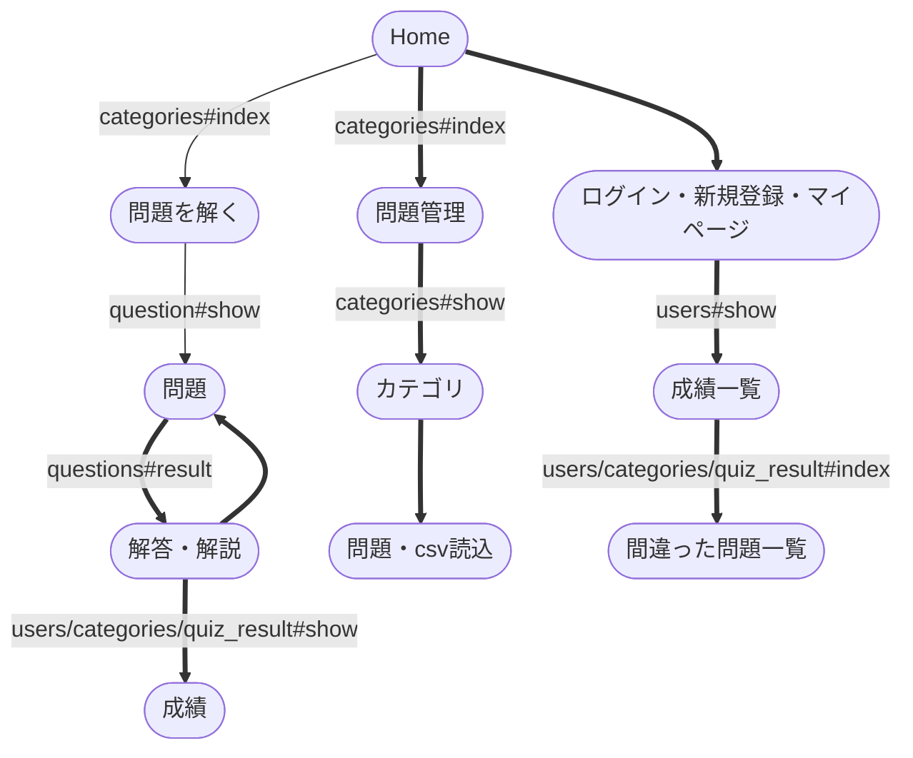

```mermaid

flowchart TB
  node_1(["Home"])
  node_2(["問題を解く"])
  node_3(["問題"])
  node_4(["解答・解説"])
  node_5(["成績"])
  node_6(["問題管理"])
  node_7(["カテゴリ"])
  node_8(["問題・csv読込"])
  node_9(["ログイン・新規登録・マイページ"])
  node_10(["成績一覧"])
  node_11(["間違った問題一覧"])
  node_1 --"categories#35;index"--> node_2
  node_2 --"question#35;show"--> node_3
  node_3 =="questions#35;result"==> node_4
  node_4 ==> node_3
  node_4 =="users/categories/quiz_result#35;show"==> node_5
  node_1 =="categories#35;index"==> node_6
  node_6 =="categories#35;show"==> node_7
  node_7 ==> node_8
  node_1 ==> node_9
  node_9 =="users#35;show"==> node_10
  node_10 =="users/categories/quiz_result#35;index"==> node_11

```
